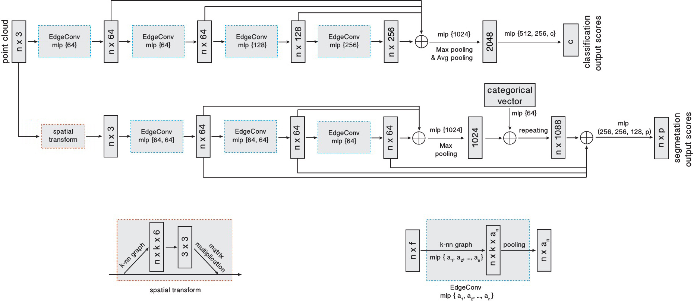

</img>

# x_dgcnn

A pytorch implementation of [DGCNN](https://arxiv.org/abs/1801.07829), more efficient and memory-saving than
[dgcnn.pytorch](https://github.com/antao97/dgcnn.pytorch).

The performance in comparison with [dgcnn.pytorch](https://github.com/antao97/dgcnn.pytorch) could be found in
the [comparison_with_dgcnn.pytorch](https://github.com/kentechx/x-dgcnn/tree/comparison_with_dgcnn.pytorch) branch.

Update: use GELU rather than LeakyReLU. Rewrite the message passing part to make it more efficient. Move the
normalization and activation after the max pooling in all instances. Make the categorical embedding learnable.
We try LayerNorm and InstanceNorm, and find that BatchNorm beats them by a large margin.

[](https://badge.fury.io/py/x-dgcnn)
[](https://opensource.org/licenses/MIT)

## Installation

```bash
pip install x-dgcnn
```

If you suffer from the error `No matching distribution found for x-dgcnn` using a mirror source, try the following
(if you know how to solve this problem, please open an issue):
```bash
pip install x-dgcnn -i https://pypi.org/simple
```

## Usage

Classification.

```python
import torch
from x_dgcnn import DGCNN_Cls

model = DGCNN_Cls(k=20, in_dim=3, out_dim=10)
x = torch.randn(8, 3, 2048)
xyz = x.clone()
out = model(x, xyz)

```

Semantic segmentation.

```python
import torch
from x_dgcnn import DGCNN_Seg

model = DGCNN_Seg(k=40, in_dim=3, out_dim=10)
x = torch.randn(8, 3, 2048)
xyz = x.clone()
out = model(x, xyz)
```

Part segmentation.

```python
import torch
from x_dgcnn import DGCNN_Seg, SpatialTransformNet

# use stn and do part segmentation
stn = SpatialTransformNet(k=40)
model = DGCNN_Seg(k=40, in_dim=9, out_dim=4, n_category=10, stn=stn)
x = torch.randn(8, 9, 2048)  # keep xyz at the first 3 channels if using stn
xyz = x[:, :3].clone()
category = torch.randint(0, 10, (10,))
out = model(x, xyz, category)
```

## TODO
- [ ] Add differentiable subset operator and coordinate descent as another option to fuse features.
- [ ] Scale up model size and test.
- [ ] Add sampling to get hierarchical features.
- [ ] Do tasks on other tasks, e.x. rotation prediction, normal prediction, etc.

## References

```bibtex
@article{wang2019dynamic,
  title={Dynamic graph cnn for learning on point clouds},
  author={Wang, Yue and Sun, Yongbin and Liu, Ziwei and Sarma, Sanjay E and Bronstein, Michael M and Solomon, Justin M},
  journal={Acm Transactions On Graphics (tog)},
  year={2019},
}
```
